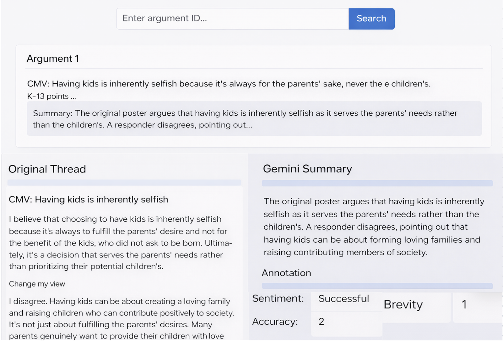

For our interface, we plan to build a simple web app that lets users explore our Reddit persuasion corpus and its annotation in an interactive way. The main input will be a text box where the user enters an argument or thread ID. After submitting the ID, the interface will return the matching item and show all of its related information together. This will include a short preview at the top, the full original thread, the Gemini generated summary, and our human annotation labels for the data that is annotated. This way the webpage will include user input through a small HTML form, search over the corpus, and give access to annotation data. A possible extension, time permitting, would be to let the user search from a dropdown of topics regarding the reddit thread, so if they are interested in a topic or want to see how well Gemini summarizes a specific kind of topic they can do that as well using a simple python index or an existing tool.

On the technical side, the front end will be built with HTML, CSS, and a small amount of JavaScript. It will contain the input box, a search button, and display sections for the returned content. When the user enters an ID and clicks search, JavaScript will send that value as a request to a FastAPI back end. FastAPI is the connection between the front end and the Python code that handles the corpus.

The back end will load our corpus, (which is a csv as of now, but might be changed to json for easier extraction) and annotation data from structured files. In our project, the corpus is stored in a format that keeps each document together with its metadata and thread structure, which makes it practical to search and retrieve with Python. Once FastAPI receives the user’s request, it will look up the matching thread ID, gather the original thread text, the Gemini summary, and the annotation fields, and return that data to the browser in a structured format. 

The browser will then display the results in a clean layout. At the top, the user will see a preview card with the ID and a short snippet so they can confirm they opened the right thread. Below that, the full thread will appear beside the Gemini summary and the annotation labels. Our labels will follow what was in the annotation with is the be sentiment, accuracy, and brevity, and they will each have a box next to it indicating the score.  This design makes the most sense because it makes it easy for a user to inspect one thread at a time and directly compare the original discussion with the generated summary and our evaluation of it.

